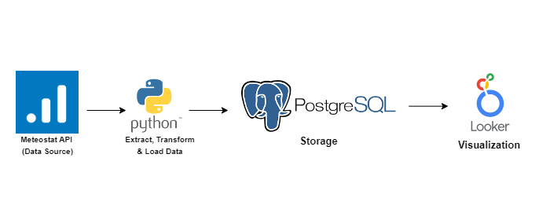

## Weather ETL Project

An end-to-end data pipeline that collects, cleans, and stores **historical weather data** for Nigerian states. This project showcases key **data engineering** principles—extraction, transformation, loading, logging, and automation—all in one place.
---

## Architecture Diagram



---

## Highlights

### Robust ETL Pipeline
- Leverages the Meteostat library to extract daily weather metrics (temperature, precipitation, etc.) since 2010.
- Transforms the data, preventing duplicate `(state, date)` records.
- Loads the cleaned data into a PostgreSQL database with automatic table creation.

### State Metadata Management
- A dedicated file (`state_metadata.py`) neatly organizes lat/long, capital names, and regions for all Nigerian states.
- This modular approach makes it easy to adapt the script for other countries or regions.

### Quality Assurance
- **Duplicate Checking**: Each `(state, date)` combination is unique in the database.
- **Comprehensive Logging**: All steps (inserts, duplicates, errors) are tracked in `weather_etl.log` for clarity and debugging.

### Scalable & Automated
- Designed to run on a schedule (Cron/Windows Task Scheduler) for daily data updates.
- Easily adapted to always-on environments (e.g., cloud VM, on-prem server) for guaranteed reliability.

---

## Data Coverage Notice

**Note**: Meteostat currently provides complete historical data for only **18 out of 37** Nigerian regions (36 states + FCT). For an in-depth discussion on handling these data gaps, check out my **Medium post**, where I share alternative data sources and potential integration strategies.

---

## Tech Stack

- **Python**: Core language for the ETL scripts.
- **Meteostat API**: Source of raw weather data.
- **PostgreSQL**: Target data warehouse; automatically initialized if absent.
- **Logging**: Built-in Python `logging` module for operational visibility.
- **Looker**: For Visualization

---

## Quick Start

### Clone & Install

```bash
git clone https://github.com/your-username/weather-etl-project.git
cd weather-etl-project
pip install -r requirements.txt
```


## Configure Credentials
Update PostgreSQL user/password in weather_etl.py.

# Run the ETL

```bash
python weather_etl.py
```

- Automatically creates the `weather_data` database if needed.
- Pulls weather data from 2010 to the current date and inserts it into `historical_weather_data`.

---

## Scheduling
- Cron (Linux/macOS) or Windows Task Scheduler can be set to run `weather_etl.py` every day (e.g., 10:00 AM) to ensure real-time dashboard insights.
- If your machine is off, the job won’t run—consider a cloud VM or a Raspberry Pi for uninterrupted scheduling.

---

## Roadmap
- Fill Data Gaps: Explore alternate APIs or open-source datasets to cover missing states.
- Scalability: Add features like parallel data ingestion, advanced error handling, or orchestrators (Airflow/Prefect).
- Expanded Use Cases: Potential for climate modeling, forecasting, and more advanced analytics.

---

## Why This Project?
- Data Engineering Showcase: Demonstrates the ETL lifecycle, from API ingestion to robust schema design.
- Best Practices: Emphasizes modular code organization, detailed logging, and duplication checks.
- Growth Potential: Can be scaled to larger datasets, more APIs, or bigger analytics frameworks.

## Contributing
Contributions are always welcome! Whether it’s suggestions to enhance the pipeline or fixes for missing data, submit a pull request. Let’s keep refining this data engineering playground.

## License
Licensed under the MIT License. Feel free to use or modify for your own data-driven projects.

---
## Thank you for checking out this Weather ETL Project!
If you have questions or want more details, read my Medium post for a deeper exploration of data coverage challenges and potential solutions.


